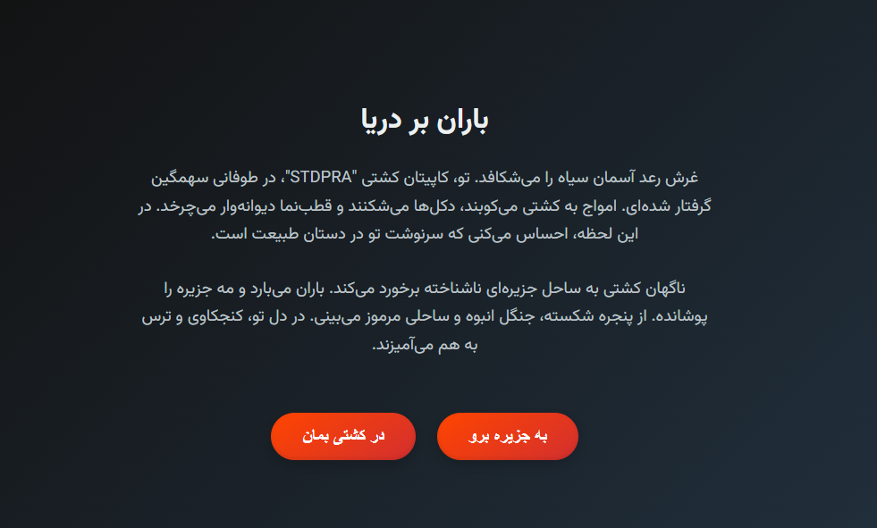

# Rain Over the Sea - Interactive Story Game

  
*(Replace the placeholder with a screenshot or banner if available)*

## Overview
"Rain Over the Sea" (باران بر دریا) is an interactive text-based adventure game written in Persian. You play as a ship captain whose vessel, "STDPRA," crashes onto a mysterious island during a violent storm. Your choices determine your fate as you explore the island's jungles, coastlines, caves, and ancient ruins. With nine distinct endings, the game blends exploration, mystery, and survival in a richly detailed narrative.

## Features
- **Language:** Persian (Farsi) with right-to-left (RTL) support.
- **Endings:** 9 unique outcomes based on player decisions, including escape, sacrifice, and becoming the island's ruler.
- **Elements:** Includes ancient talismans, native tribes, hidden temples, a sea monster, toxic fog, and more.
- **Tech Stack:** Built using HTML for structure and CSS for styling (JavaScript file included but not implemented in this version).
- **Responsive Design:** Works on various screen sizes with a simple, immersive interface.

## How to Play
1. Open `index.html` in a web browser.
2. Read the story and click on the buttons to make choices.
3. Navigate through the island, uncover its secrets, and reach one of the nine endings.
4. Restart by clicking "دوباره شروع کن" (Start Again) at the end.
